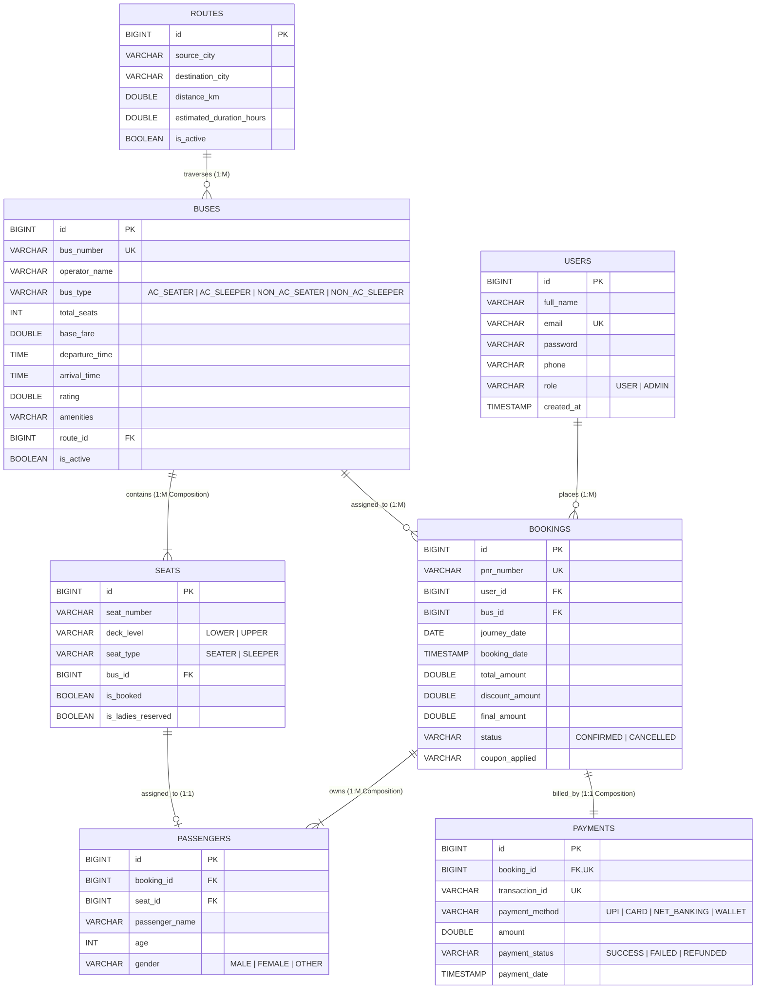

# BUSORA – Entity-Relationship (ER) Diagram

This diagram displays the relational database schema of **BUSORA**, detailing entities, keys, attributes, and cardinality constraints.

```mermaid
erDiagram
    USERS ||--o{ BOOKINGS : "places (1:M)"
    ROUTES ||--o{ BUSES : "traverses (1:M)"
    BUSES ||--|{ SEATS : "contains (1:M Composition)"
    BUSES ||--o{ BOOKINGS : "assigned_to (1:M)"
    BOOKINGS ||--|{ PASSENGERS : "owns (1:M Composition)"
    SEATS ||--o| PASSENGERS : "assigned_to (1:1)"
    BOOKINGS ||--|| PAYMENTS : "billed_by (1:1 Composition)"

    USERS {
        BIGINT id PK
        VARCHAR full_name
        VARCHAR email UK
        VARCHAR password
        VARCHAR phone
        VARCHAR role "USER | ADMIN"
        TIMESTAMP created_at
    }

    ROUTES {
        BIGINT id PK
        VARCHAR source_city
        VARCHAR destination_city
        DOUBLE distance_km
        DOUBLE estimated_duration_hours
        BOOLEAN is_active
    }

    BUSES {
        BIGINT id PK
        VARCHAR bus_number UK
        VARCHAR operator_name
        VARCHAR bus_type "AC_SEATER | AC_SLEEPER | NON_AC_SEATER | NON_AC_SLEEPER"
        INT total_seats
        DOUBLE base_fare
        TIME departure_time
        TIME arrival_time
        DOUBLE rating
        VARCHAR amenities
        BIGINT route_id FK
        BOOLEAN is_active
    }

    SEATS {
        BIGINT id PK
        VARCHAR seat_number
        VARCHAR deck_level "LOWER | UPPER"
        VARCHAR seat_type "SEATER | SLEEPER"
        BIGINT bus_id FK
        BOOLEAN is_booked
        BOOLEAN is_ladies_reserved
    }

    BOOKINGS {
        BIGINT id PK
        VARCHAR pnr_number UK
        BIGINT user_id FK
        BIGINT bus_id FK
        DATE journey_date
        TIMESTAMP booking_date
        DOUBLE total_amount
        DOUBLE discount_amount
        DOUBLE final_amount
        VARCHAR status "CONFIRMED | CANCELLED"
        VARCHAR coupon_applied
    }

    PASSENGERS {
        BIGINT id PK
        BIGINT booking_id FK
        BIGINT seat_id FK
        VARCHAR passenger_name
        INT age
        VARCHAR gender "MALE | FEMALE | OTHER"
    }

    PAYMENTS {
        BIGINT id PK
        BIGINT booking_id FK, UK
        VARCHAR transaction_id UK
        VARCHAR payment_method "UPI | CARD | NET_BANKING | WALLET"
        DOUBLE amount
        VARCHAR payment_status "SUCCESS | FAILED | REFUNDED"
        TIMESTAMP payment_date
    }
```
