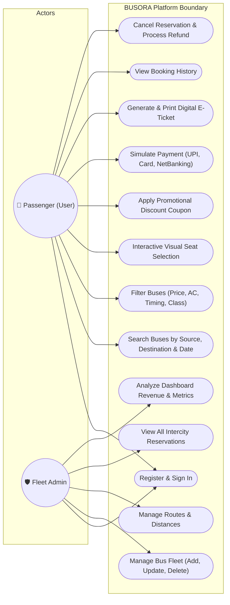

# BUSORA – Use Case Diagram

This diagram documents the functional requirements and interaction boundaries between **Passenger (User)** and **System Administrator (Admin)** actors.

```mermaid
flowchart LR
    subgraph Actors
        U(("👤 Passenger (User)"))
        A(("🛡️ Fleet Admin"))
    end

    subgraph BusoraPlatform ["BUSORA Platform Boundary"]
        UC1(["Register & Sign In"])
        UC2(["Search Buses by Source, Destination & Date"])
        UC3(["Filter Buses (Price, AC, Timing, Class)"])
        UC4(["Interactive Visual Seat Selection"])
        UC5(["Apply Promotional Discount Coupon"])
        UC6(["Simulate Payment (UPI, Card, NetBanking)"])
        UC7(["Generate & Print Digital E-Ticket"])
        UC8(["View Booking History"])
        UC9(["Cancel Reservation & Process Refund"])
        
        UC10(["Manage Bus Fleet (Add, Update, Delete)"])
        UC11(["Manage Routes & Distances"])
        UC12(["View All Intercity Reservations"])
        UC13(["Analyze Dashboard Revenue & Metrics"])
    end

    %% Passenger Associations
    U --> UC1
    U --> UC2
    U --> UC3
    U --> UC4
    U --> UC5
    U --> UC6
    U --> UC7
    U --> UC8
    U --> UC9

    %% Admin Associations
    A --> UC1
    A --> UC10
    A --> UC11
    A --> UC12
    A --> UC13
```
